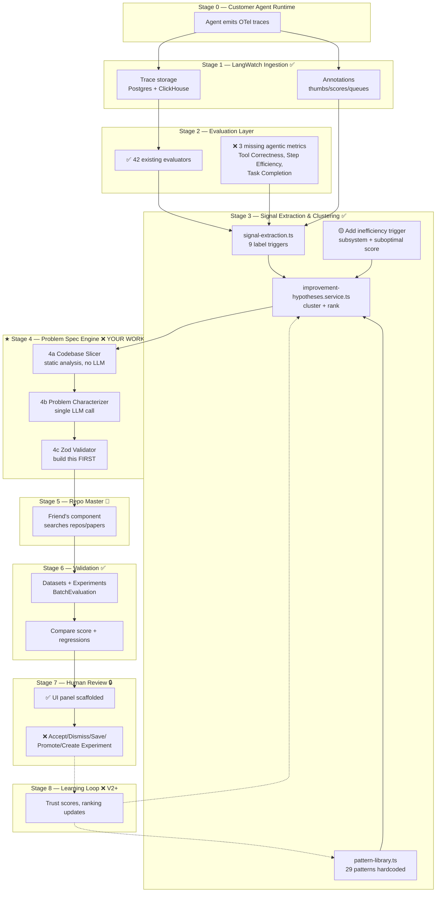

# Improvement Hypotheses — Complete Flow Reference

> The single diagram you reference every day to know what's built, what's not, and what you're working on right now.

---

## Legend

```
✅  = Already exists in LangWatch / scaffolded — DO NOT REBUILD, just consume
🟡  = Partially exists — needs small extension
❌  = Does not exist — YOU build this
👫  = Friend's component (Repo Master) — out of your scope
🔒  = Never auto-apply (PRD §18)
```

---

## The Complete Block Diagram

```
┌────────────────────────────────────────────────────────────────────────────────┐
│                          STAGE 0 — RUNTIME (customer's agent)                  │
│                                                                                │
│   Customer agent runs in production OR in eval harness                         │
│   Emits: OTel spans, LLM calls, tool calls, errors, latency                    │
│                                                                                │
│   ✅ Customer instruments using python-sdk/ or typescript-sdk/                  │
└──────────────────────────────────────┬─────────────────────────────────────────┘
                                       │ traces flow in
                                       ▼
┌────────────────────────────────────────────────────────────────────────────────┐
│                       STAGE 1 — INGESTION & STORAGE                            │
│                                                                                │
│  ✅ Trace ingestion service                                                     │
│       langwatch/src/server/tracer/                                             │
│       langwatch/src/server/event-sourcing/pipelines/trace-processing/          │
│                                                                                │
│  ✅ Storage backends                                                            │
│       Postgres (Prisma)  → schema.prisma:255-323                               │
│       ClickHouse         → analytics + evaluations                             │
│       S3 (optional)      → large payloads                                      │
│                                                                                │
│  ✅ Annotations / human feedback                                                │
│       Annotation, AnnotationScore, AnnotationQueue models                      │
│       schema.prisma:623-792                                                    │
└──────────────────────────────────────┬─────────────────────────────────────────┘
                                       │
                                       ▼
┌────────────────────────────────────────────────────────────────────────────────┐
│                       STAGE 2 — EVALUATION LAYER                               │
│                                                                                │
│  ✅ 42 existing evaluators (run as monitors: on-message / guardrail / manual)   │
│       langwatch/src/server/evaluations/evaluators.generated.ts                 │
│       langwatch_nlp/studio/modules/evaluators/                                 │
│                                                                                │
│       RAG (12)         — faithfulness, context precision/recall, factual...   │
│       Quality (10)     — exact_match, llm_answer_match, sentiment, rubric...  │
│       Safety (6)       — PII, moderation, jailbreak, prompt injection...      │
│       Policy (4)       — off_topic, competitor checks                          │
│       Custom (6)       — llm_boolean, llm_score, llm_category, similarity     │
│       Agentic (1)      — query_resolution                                      │
│                                                                                │
│  🟡 MISSING agentic metrics (your work, day 5):                                 │
│       ❌ Tool Correctness (scored, not pass/fail)                              │
│       ❌ Step Efficiency                                                        │
│       ❌ Task Completion (scored)                                               │
│       Add to: langwatch_nlp/studio/modules/evaluators/                         │
│                                                                                │
│  ✅ Eval results stored in ClickHouse, retrievable via:                         │
│       EvaluationService.getEvaluationsForTrace()                               │
└──────────────────────────────────────┬─────────────────────────────────────────┘
                                       │
                                       ▼
┌────────────────────────────────────────────────────────────────────────────────┐
│           STAGE 3 — SIGNAL EXTRACTION & FAILURE CLUSTERING                     │
│                                                                                │
│  ✅ Signal extraction (per trace)                                               │
│       langwatch/src/server/improvement-hypotheses/signal-extraction.ts         │
│       Reads:  trace + spans + events + evaluations                             │
│       Emits:  TraceDiagnostic { labels, signalTags, signalDetails, ... }       │
│                                                                                │
│       Current label triggers (line refs in signal-extraction.ts):              │
│         • too_few_clarifying_questions     ← line 253                          │
│         • premature_tool_execution         ← line 260                          │
│         • too_many_clarifying_questions    ← line 271                          │
│         • wrong_tool_selection             ← line 279                          │
│         • weak_retrieval_grounding         ← line 286                          │
│         • weak_error_recovery              ← line 293                          │
│         • excessive_reasoning_or_latency   ← line 301  ◄── ONLY current        │
│         • shallow_final_answer             ← line 309      inefficiency        │
│                                                            trigger             │
│                                                                                │
│  🟡 INEFFICIENCY EXTENSION (your work, day 4)                                   │
│       ❌ Add subsystem tag convention to span metadata                         │
│       ❌ Add 3rd trigger: subsystem + eval score in 0.6-0.75 range             │
│         (working but suboptimal — not a failure)                               │
│       ❌ Add 2 new tests for inefficiency cases                                │
│                                                                                │
│  ✅ Clustering + ranking                                                        │
│       langwatch/src/server/improvement-hypotheses/improvement-hypotheses.service.ts │
│       Groups TraceDiagnostics → FailureCluster[]                               │
│       Ranks patterns by:  evidenceStrength * 3 + signalOverlap                 │
│       Severity = traceCount*2 + negFeedback + (avgScore<0.4 ? 2 : 0)           │
│                                                                                │
│  ✅ Pattern library (29 patterns, hardcoded)                                    │
│       langwatch/src/server/improvement-hypotheses/pattern-library.ts           │
│       langwatch/src/server/improvement-hypotheses/taxonomy.ts                  │
│                                                                                │
│  ❌ Pattern library persistence (post-MVP)                                      │
│  ❌ Candidate-pattern staging table (post-MVP)                                  │
└──────────────────────────────────────┬─────────────────────────────────────────┘
                                       │ FailureCluster[] with hypotheses
                                       ▼
╔════════════════════════════════════════════════════════════════════════════════╗
║  ★★★  STAGE 4 — PROBLEM SPECIFICATION ENGINE   ★★★                             ║
║              (THIS IS YOUR WORK — entirely new code)                           ║
║                                                                                ║
║  Location: langwatch/src/server/improvement-hypotheses/problem-specification/  ║
║                                                                                ║
║  ┌──────────────────────────────────────────────────────────────────────┐     ║
║  │  Sub-stage 4a — Codebase Slicer  (day 6, NO LLM, static analysis)    │     ║
║  │  Input:   subsystemName + repoPath                                    │     ║
║  │  Output:  CodeLocation[] (entryPoint, deps, callers, config, tests)   │     ║
║  │  Tools:   ts-morph or tree-sitter                                     │     ║
║  └────────────────────────┬─────────────────────────────────────────────┘     ║
║                           ▼                                                    ║
║  ┌──────────────────────────────────────────────────────────────────────┐     ║
║  │  Sub-stage 4b — Problem Characterizer  (day 7, single LLM pass)       │     ║
║  │  Input:   FailureCluster + slicer output + customer config            │     ║
║  │          (config from ✅ LangWatch prompt/agent metadata)              │     ║
║  │  Output:  draft ProblemSpecification                                  │     ║
║  │  Model:   gpt-5-mini (per CLAUDE.md)                                  │     ║
║  └────────────────────────┬─────────────────────────────────────────────┘     ║
║                           ▼                                                    ║
║  ┌──────────────────────────────────────────────────────────────────────┐     ║
║  │  Sub-stage 4c — Schema Validator + Contract Emitter  (day 2, FIRST)   │     ║
║  │  Zod schema rejects: empty nonGoals, vague mustHave,                  │     ║
║  │                       non-numeric deficiencyMetrics                   │     ║
║  │  Retry on validation failure with errors as LLM feedback              │     ║
║  └────────────────────────┬─────────────────────────────────────────────┘     ║
║                           ▼                                                    ║
║                  final ProblemSpecification                                    ║
║                  (validated, schema-conformant)                                ║
╚════════════════════════════════════════════════════════════════════════════════╝
                                       │
                                       ▼
┌────────────────────────────────────────────────────────────────────────────────┐
│                  STAGE 5 — REPO MASTER                                         │
│                  👫 (your friend's component — out of your scope)              │
│                                                                                │
│  Input:   ProblemSpecification (your contract)                                 │
│  Process: searches GitHub repos / papers, ranks candidates                     │
│  Output:  CandidateSolution[] each with                                        │
│             - source URL                                                        │
│             - method description                                                │
│             - code reference                                                    │
│             - claimed benchmark numbers                                         │
│             - estimated compatibility                                           │
│                                                                                │
│  ⚠️  Sync with friend: agree on this output contract by end of Day 2          │
└──────────────────────────────────────┬─────────────────────────────────────────┘
                                       │ CandidateSolution[]
                                       ▼
┌────────────────────────────────────────────────────────────────────────────────┐
│         STAGE 6 — VALIDATION & EXPERIMENTATION                                 │
│                                                                                │
│  ✅ Datasets — historical traces grouped for replay                             │
│       schema.prisma:441-473  (Dataset, DatasetRecord)                          │
│                                                                                │
│  ✅ Experiments + Batch Evaluations                                             │
│       schema.prisma:535-621  (Experiment, BatchEvaluation)                     │
│       Types: BATCH_EVALUATION_V2, EVALUATIONS_V3, DSPY                         │
│                                                                                │
│  ✅ Suggested eval comes pre-attached to each hypothesis                        │
│       (suggestedEval { name, metric, successCriteria } in pattern-library.ts)  │
│                                                                                │
│  How it runs:                                                                  │
│    1. Take a CandidateSolution from repo master                                │
│    2. Apply (sandboxed, NEVER to live customer code) ← 🔒 §18                   │
│    3. Run BatchEvaluation on the dataset using suggested eval                  │
│    4. Compare score: candidate vs baseline                                     │
│    5. Compare regressionGuards: did anything else break?                       │
│                                                                                │
│  ❌ Sandboxed apply mechanism (post-MVP — can be manual at first)               │
└──────────────────────────────────────┬─────────────────────────────────────────┘
                                       │ ValidationResult
                                       ▼
┌────────────────────────────────────────────────────────────────────────────────┐
│                  STAGE 7 — HUMAN REVIEW & DECISION                             │
│                                                                                │
│  ✅ UI panel scaffolded                                                         │
│       langwatch/src/components/traces/ImprovementHypotheses.tsx                │
│       Displays: cluster + hypotheses + confidence + evidence                   │
│                                                                                │
│  🔒 Human-in-the-loop is MANDATORY (PRD §18)                                    │
│                                                                                │
│  Actions (per PRD §12.7):                                                      │
│    ❌ Accept                                                                    │
│    ❌ Dismiss                                                                   │
│    ❌ Save                                                                      │
│    ❌ Promote to Requirement                                                    │
│    ❌ Create Experiment   ← reuses ✅ LangWatch experiments                     │
│                                                                                │
│  ❌ Decision logging (post-MVP — feeds Stage 8 learning)                        │
└──────────────────────────────────────┬─────────────────────────────────────────┘
                                       │ logged decisions
                                       ▼
┌────────────────────────────────────────────────────────────────────────────────┐
│                  STAGE 8 — LEARNING LOOP (post-MVP, V2+)                       │
│                                                                                │
│  ❌ Track accept/dismiss rates per pattern                                      │
│  ❌ Update pattern trust scores                                                 │
│  ❌ Update ranking weights                                                      │
│  ❌ Surface candidate patterns from accepted solutions                          │
│                                                                                │
│  Note: don't build this in V1. The data must accumulate first.                 │
└────────────────────────────────────────────────────────────────────────────────┘
```

---

## Same Flow as Mermaid (renders in any markdown viewer)



---

## What you build, in order (your 2-week plan compressed)

| Day | Stage | File / Action |
|---|---|---|
| 1 | Stage 3 | Run existing tests; read `signal-extraction.ts` end-to-end |
| 2 | **Stage 4c FIRST** | Write Zod schema for `ProblemSpecification` |
| 3 | Stage 4 | Hand-write 3 reference specs (golden tests) |
| 4 | Stage 3 ext | Add inefficiency trigger to `signal-extraction.ts:301` |
| 5 | Stage 2 ext | Add 3 missing agentic metrics to langevals |
| 6 | Stage 4a | Build codebase slicer (static analysis) |
| 7 | Stage 4b | Build problem characterizer (LLM) |
| 8 | Stage 4 → 5 | tRPC endpoint; persist specs; wire to friend's contract |
| 9 | Stage 4 eval | Score engine output against reference specs |
| 10 | End-to-end | Demo full flow with mocked repo master |

---

## Three things to ALWAYS remember

1. **Stage 4c (Zod schema) is the most important file you write.** It's the contract with your friend. Build it on Day 2 — before anything else in your engine.

2. **Stages 1, 2, 3, 6 are LangWatch's job.** You query them, you don't rebuild them. Every time you start writing trace ingestion or evaluation code, stop and use what's there.

3. **Stage 7 actions and Stage 8 learning are post-MVP.** Resist the temptation to build them early. They need real usage data to be meaningful.

---

## What's NOT in this diagram (intentionally)

- **TraceRoot** — overlaps with Stage 1 (LangWatch already does this). Don't add it.
- **DeepEval** — overlaps with Stage 2 (LangWatch's 42 evaluators + your 3 additions cover it).
- **Auto-apply / autonomous code modification** — violates PRD §18. Stage 7 is human-gated forever.
- **Internet-scale paper/repo crawling** — violates PRD §14. Repo master operates on the curated contract you give it.

---

## Where you are today (as of this writing)

```
Stage 0  ✅ done
Stage 1  ✅ done (in LangWatch)
Stage 2  ✅ partial (3 metrics missing — your day 5)
Stage 3  ✅ scaffolded (inefficiency trigger missing — your day 4)
Stage 4  ❌ NOT STARTED  ← YOU ARE HERE
Stage 5  👫 friend's work
Stage 6  ✅ done (in LangWatch)
Stage 7  🟡 UI scaffolded, actions not wired
Stage 8  ❌ V2+
```

Your next concrete action: open `langwatch/src/server/improvement-hypotheses/` and create `problem-specification/types.ts` with the Zod schema from section 6 of `improvement-hypotheses-conversation.md`. That's day 2.
